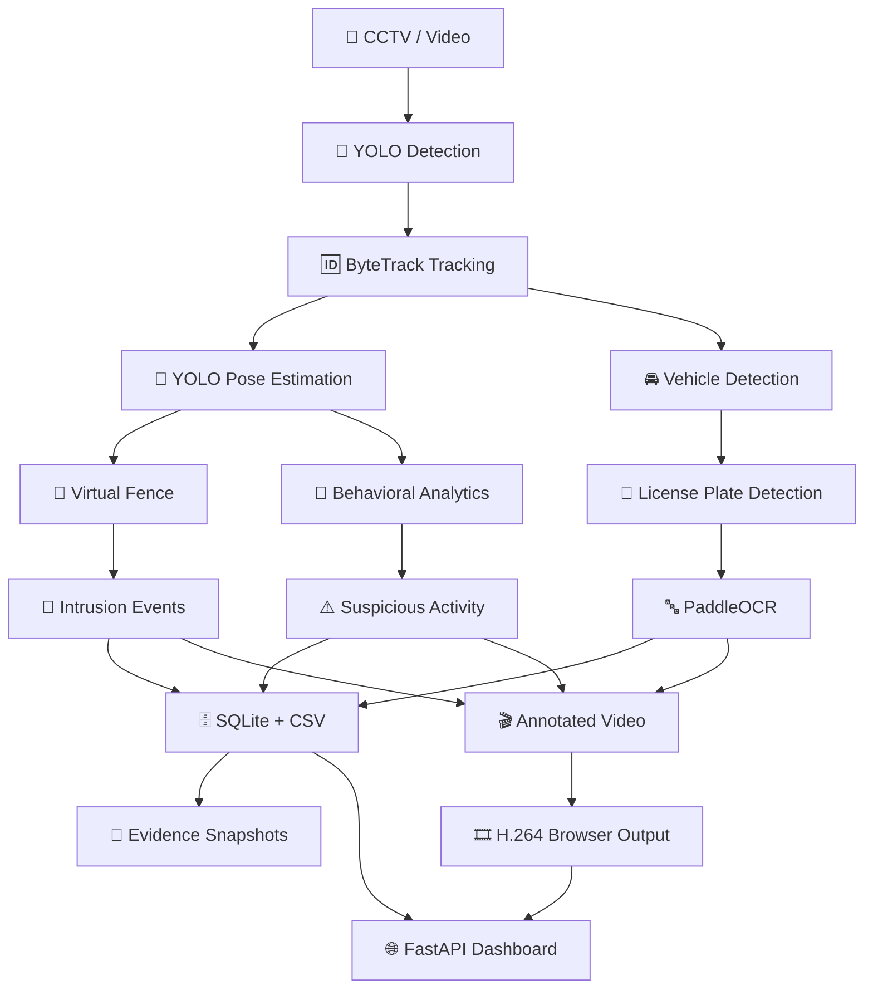
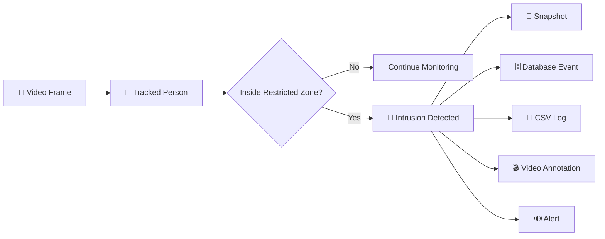
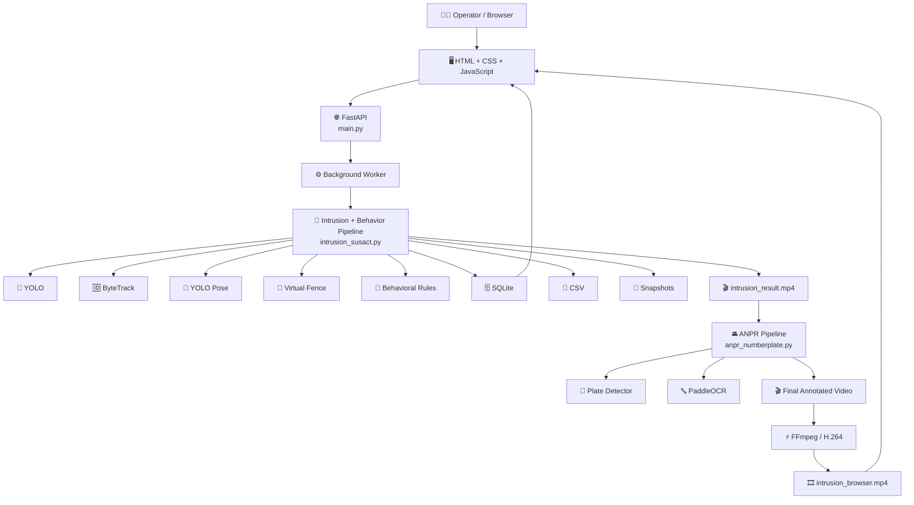

# 🚨 IBVAP

## Intelligent Border Video Analysis Platform

> **AI-assisted video intelligence for intrusion detection, behavioral analysis, vehicle recognition and situational awareness.**

<p align="center">

[](https://www.python.org/)
[](https://fastapi.tiangolo.com/)
[](https://docs.ultralytics.com/)
[](https://opencv.org/)
[](https://pytorch.org/)
[](https://www.paddleocr.ai/)
[](https://www.sqlite.org/)

</p>

<p align="center">

**YOLO • ByteTrack • Pose Estimation • Virtual Fence • Behavioral Analytics • ANPR • OCR • FastAPI**

</p>

---

## 🎯 What is IBVAP?

Traditional CCTV systems require operators to continuously monitor hours of footage.

**IBVAP adds an AI intelligence layer to surveillance video.**

It analyzes CCTV footage, detects and tracks objects, identifies restricted-zone intrusions, analyzes human movement and posture, detects license plates, extracts plate text using OCR, records evidence, and presents the results through a web dashboard.

### In simple words:

```text
CCTV VIDEO
     ↓
AI SEES OBJECTS
     ↓
AI TRACKS THEM
     ↓
AI UNDERSTANDS MOVEMENT
     ↓
AI CHECKS RESTRICTED ZONES
     ↓
AI ANALYZES BEHAVIOR
     ↓
AI READS LICENSE PLATES
     ↓
EVENTS + EVIDENCE
     ↓
WEB DASHBOARD
```

---

## ⭐ Why IBVAP?

| Traditional CCTV               | IBVAP                      |
| ------------------------------ | -------------------------- |
| 👁️ Human watches everything   | 🤖 AI analyzes the footage |
| ⏳ Time-consuming monitoring    | ⚡ Automated detection      |
| 🔍 Difficult to review footage | 🎯 Events are identified   |
| 🚧 Manual intrusion detection  | 📐 Virtual-fence detection |
| 🚘 Manual plate checking       | 🔤 ANPR + OCR              |
| 📸 Manual evidence collection  | 📸 Automatic snapshots     |
| 📄 Manual event recording      | 🗄️ SQLite + CSV logging   |
| 🎬 Raw CCTV footage            | 🎬 AI-annotated output     |

---

# 🧠 How IBVAP Works



---

# ✨ Core Features

### 🎯 Object Detection

Detects:

* 👤 Humans
* 🚗 Cars
* 🏍️ Motorcycles
* 🚌 Buses
* 🚚 Trucks

Powered by **Ultralytics YOLO**.

[](https://docs.ultralytics.com/)

---

### 🆔 Object Tracking

IBVAP uses **ByteTrack** to maintain object identities across video frames.

```text
YOLO Detection
      ↓
ByteTrack
      ↓
Object ID
      ↓
Movement History
      ↓
Behavior Analysis
```

---

### 🧍 Human Pose Estimation

YOLO Pose provides human body keypoints that allow IBVAP to analyze:

* 🙌 Hands raised
* 🧎 Crouching
* 📍 Human position
* 📐 Body geometry
* 🏃 Movement

Model:

```text
backend/yolo11n-pose.pt
```

---

# 🚧 Virtual-Fence Intrusion Detection

IBVAP allows a restricted polygonal region to be defined inside the video.



The API currently accepts a **3–4 point polygon**.

When an intrusion is detected, IBVAP can:

* 🚨 Create an intrusion event
* 📸 Capture evidence
* 🗄️ Store event metadata
* 📄 Write to CSV
* 🎬 Annotate the result video
* 🔊 Trigger a sound alert

---

# 🧠 Behavioral Analytics

IBVAP currently uses **rule-based behavioral analytics**, not a trained suspicious-behavior classifier.

### Current indicators

| Behavior                | Description                                        |
| ----------------------- | -------------------------------------------------- |
| 🕒 **Loitering**        | Prolonged presence within a defined area           |
| 🏃 **Rapid Movement**   | Movement exceeding configured thresholds           |
| 🔄 **Erratic Movement** | Significant repeated changes in movement direction |
| 🙌 **Hands Raised**     | Both wrists detected above corresponding shoulders |
| 🧎 **Crouching**        | Body compression estimated from pose geometry      |

> ⚠️ These are behavioral indicators, **not proof of criminal intent**.

---

# 🚘 ANPR — Automatic Number Plate Recognition

IBVAP processes vehicle footage through an additional ANPR pipeline.


### ANPR pipeline

```text
Vehicle Detection
       ↓
License Plate Detection
       ↓
Plate Filtering
       ↓
Image Enhancement
       ↓
PaddleOCR
       ↓
OCR Candidate Collection
       ↓
Temporal Voting
       ↓
Indian Registration Validation
       ↓
Confirmed Plate Annotation
```

### Models

**Plate detector**

```text
models/iitj_cv_bharat_plate.pt
```

**OCR**

```text
PaddleOCR
PP-OCRv5_server_rec
CPU
```

[](https://www.paddleocr.ai/)

> The current ANPR pipeline produces plate information in the processed output, but confirmed plate numbers are not automatically persisted into the SQLite `plate_number` field.

---

# 🏗️ System Architecture



---

# 🔄 Complete Processing Flow

```text
┌─────────────────────┐
│    🎥 CCTV VIDEO    │
└──────────┬──────────┘
           ↓
┌─────────────────────┐
│    🎯 YOLO          │
│ Object Detection    │
└──────────┬──────────┘
           ↓
┌─────────────────────┐
│    🆔 ByteTrack     │
│ Object Tracking     │
└──────────┬──────────┘
           ↓
┌─────────────────────┐
│    🧍 YOLO POSE     │
│ Human Keypoints     │
└──────────┬──────────┘
           ↓
     ┌─────┴─────┐
     ↓           ↓
┌──────────┐ ┌──────────────┐
│🚧 Fence  │ │🧠 Behavior   │
│Detection │ │  Analytics   │
└────┬─────┘ └──────┬───────┘
     │              │
     └──────┬───────┘
            ↓
    ┌───────────────┐
    │ 🚨 AI Events  │
    └───────┬───────┘
            ↓
   ┌────────┼────────┐
   ↓        ↓        ↓
 SQLite    CSV    Snapshots
   │
   ↓
intrusion_result.mp4
   │
   ↓
┌─────────────────────┐
│ 🚘 ANPR + OCR       │
└──────────┬──────────┘
           ↓
┌─────────────────────┐
│ 🎬 Final Video      │
└──────────┬──────────┘
           ↓
┌─────────────────────┐
│ ⚡ H.264 / FFmpeg   │
└──────────┬──────────┘
           ↓
┌─────────────────────┐
│ 🌐 Web Dashboard    │
└─────────────────────┘
```

---

# 📊 Current Capabilities

| Feature                    |      Status     |
| -------------------------- | :-------------: |
| 🎯 Person detection        |        ✅        |
| 🚗 Vehicle detection       |        ✅        |
| 🆔 ByteTrack tracking      |        ✅        |
| 🧍 Pose estimation         |        ✅        |
| 🚧 Virtual fence           |        ✅        |
| 🚨 Intrusion detection     |        ✅        |
| 🧠 Behavioral analytics    |        ✅        |
| 📸 Evidence snapshots      |        ✅        |
| 📄 CSV event logging       |        ✅        |
| 🗄️ SQLite persistence     |        ✅        |
| 🚘 License plate detection |        ✅        |
| 🔤 OCR                     |        ✅        |
| 🎬 Annotated output video  |        ✅        |
| 🌐 Browser H.264 output    |        ✅        |
| 📡 MJPEG stream            |        ✅        |
| 📊 Dashboard statistics    |        ✅        |
| 🌙 Night vision            | 🧪 Experimental |
| 👤 Face recognition        |  🧪 Standalone  |
| 📡 RTSP cameras            |    🚧 Planned   |
| 📤 Video upload API        |    🚧 Planned   |
| 🔐 Authentication          |    🚧 Planned   |

---

# 🧩 Technology Stack

## 🔥 Core Technologies

<p align="center">

[](https://www.python.org/)
[](https://fastapi.tiangolo.com/)
[](https://docs.ultralytics.com/)
[](https://opencv.org/)
[](https://pytorch.org/)
[](https://www.paddleocr.ai/)
[](https://numpy.org/)
[](https://www.sqlite.org/)

</p>

### What each one does

| Technology          | Role inside IBVAP                   |
| ------------------- | ----------------------------------- |
| 🐍 **Python**       | Main programming language           |
| 🌐 **FastAPI**      | Backend API and orchestration       |
| 🎯 **YOLO**         | Object detection, tracking and pose |
| 🆔 **ByteTrack**    | Object tracking                     |
| 👁️ **OpenCV**      | Video processing                    |
| 🧍 **YOLO Pose**    | Human keypoints                     |
| 🔤 **PaddleOCR**    | License-plate text recognition      |
| 🔥 **PyTorch**      | AI model inference                  |
| 🔢 **NumPy**        | Geometry and numerical operations   |
| 🗄️ **SQLite**      | Event storage                       |
| ⚡ **FFmpeg**        | Browser-compatible video encoding   |
| 🖥️ **HTML/CSS/JS** | Dashboard                           |

---

# 📂 Project Structure

```text
IBVAP/
│
├── main.py
│
├── backend/
│   ├── intrusion_susact.py
│   ├── anpr_numberplate.py
│   ├── face_reco.py
│   ├── night_detection_test.py
│   ├── yolo26n.pt
│   ├── yolo11n-pose.pt
│   │
│   └── logs/
│       ├── intrusion_log.csv
│       └── snapshots/
│
├── models/
│   └── iitj_cv_bharat_plate.pt
│
├── database/
│   ├── db.py
│   ├── schema.sql
│   ├── ibvap.db
│   └── test_db.py
│
├── frontend/
│   ├── index.html
│   ├── script.js
│   ├── style.css
│   └── assets/
│
├── data/
│   ├── raw/
│   ├── test/
│   ├── test_setup/
│   └── README.md
│
├── cctv.mp4
├── intrusion_result.mp4
└── intrusion_browser.mp4
```

---

# 🚀 Quick Start

## 1️⃣ Clone the repository

```bash
git clone <YOUR_REPOSITORY_URL>
cd IBVAP
```

## 2️⃣ Create a virtual environment

### Windows

```powershell
py -m venv .venv
.venv\Scripts\Activate.ps1
```

### Linux / macOS

```bash
python3 -m venv .venv
source .venv/bin/activate
```

## 3️⃣ Install dependencies

```bash
python -m pip install --upgrade pip setuptools wheel
```

```bash
python -m pip install fastapi uvicorn pydantic opencv-python numpy torch ultralytics imageio-ffmpeg
```

Install ANPR dependencies:

```bash
python -m pip install paddleocr paddlepaddle
```

Optional standalone face recognition:

```bash
python -m pip install insightface onnxruntime
```

---

# 🤖 Required AI Models

Make sure these files exist:

```text
backend/yolo26n.pt
backend/yolo11n-pose.pt
models/iitj_cv_bharat_plate.pt
```

| Model                     | Purpose                     |
| ------------------------- | --------------------------- |
| `yolo26n.pt`              | Object detection + tracking |
| `yolo11n-pose.pt`         | Human pose estimation       |
| `iitj_cv_bharat_plate.pt` | License-plate detection     |
| `PP-OCRv5_server_rec`     | OCR                         |

---

# ▶️ Run IBVAP

Start the API:

```bash
python -m uvicorn main:app --host 127.0.0.1 --port 8000
```

Development mode:

```bash
python -m uvicorn main:app --host 127.0.0.1 --port 8000 --reload
```

Then open:

### 🌐 Dashboard

```text
http://127.0.0.1:8000/
```

### 📖 Swagger API Documentation

```text
http://127.0.0.1:8000/docs
```

### 📚 ReDoc

```text
http://127.0.0.1:8000/redoc
```

---

# 🔌 API

| Method | Endpoint                   | Description            |
| ------ | -------------------------- | ---------------------- |
| `GET`  | `/`                        | Dashboard              |
| `GET`  | `/api/health`              | System health          |
| `GET`  | `/api/stats`               | Dashboard statistics   |
| `GET`  | `/api/events`              | Event history          |
| `GET`  | `/api/events/latest`       | Latest event           |
| `GET`  | `/api/detection/status`    | Detection status       |
| `POST` | `/api/detection/start`     | Start AI processing    |
| `POST` | `/api/detection/reset`     | Reset processing       |
| `GET`  | `/api/camera/frame`        | First CCTV frame       |
| `GET`  | `/api/stream`              | Processed MJPEG stream |
| `GET`  | `/api/output-video`        | Final processed video  |
| `GET`  | `/api/video/{filename}`    | Allowlisted video      |
| `GET`  | `/api/evidence/{filename}` | Evidence image         |
| `GET`  | `/api/evidence?limit=N`    | Evidence list          |

---

# ▶️ Start Detection

Example:

```json
{
  "fence_points": [
    [100, 100],
    [500, 100],
    [500, 400],
    [100, 400]
  ],
  "camera_id": "CAM_01",
  "video": "cctv.mp4"
}
```

Send to:

```text
POST /api/detection/start
```

The API starts the AI pipeline in a background worker.

---

# 🎬 Output

IBVAP generates:

```text
intrusion_result.mp4
```

and then creates the browser-compatible version:

```text
intrusion_browser.mp4
```

The final browser output is encoded using:

```text
H.264
YUV420P
Faststart MP4
```

---

# 📊 Event Storage

IBVAP uses SQLite.

```text
database/ibvap.db
```

Events contain:

```text
id
timestamp
camera_id
object_type
track_id
event_type
confidence
snapshot_path
plate_number
```

The intrusion pipeline also creates:

```text
backend/logs/intrusion_log.csv
```

Evidence images:

```text
backend/logs/snapshots/
```

---

# 🖥️ Web Dashboard

The frontend is intentionally lightweight.

```text
HTML
 ↓
CSS
 ↓
JavaScript
 ↓
FastAPI
 ↓
AI Backend
```

No React.

No Vue.

No separate Node server.

### Dashboard includes

* 📹 Surveillance feed
* 🚨 Event monitoring
* 📊 Statistics
* 🎬 Processed video
* 🌓 Day/night theme
* 🕐 IST clock
* 📱 Responsive navigation
* 🔌 API integration

---

# 🧪 Experimental Features

## 👤 Face Recognition

```text
backend/face_reco.py
```

Uses InsightFace.

Currently **not connected to the active FastAPI pipeline**.

---

## 🌙 Night / Low-Light Detection

```text
backend/night_detection_test.py
```

Uses CLAHE-based image enhancement.

Currently **experimental and not connected to the active API pipeline**.

---

# ⚠️ Current Limitations

IBVAP is currently a **video-file based prototype**.

### Not yet implemented

* 📡 RTSP/IP camera ingestion
* 📤 Multipart video upload API
* 🔐 Authentication
* 👥 Multi-user access control
* 🔑 API keys
* 🛡️ RBAC
* 🔒 HTTPS/TLS
* 🚦 Rate limiting
* ⚙️ Runtime threshold configuration
* 🧵 Production job queue
* 🧪 Full API integration test suite

### GPU requirement

The active intrusion pipeline currently uses:

```text
device=0
half=True
```

Therefore the current implementation assumes an available GPU device.

### ANPR

PaddleOCR is configured for CPU processing and may become a bottleneck for long videos.

---

# 🗺️ Roadmap

## 🟢 Phase 1 — Foundation

* [x] YOLO detection
* [x] ByteTrack tracking
* [x] Pose estimation
* [x] Virtual-fence intrusion detection
* [x] Behavioral indicators
* [x] Evidence snapshots
* [x] SQLite persistence
* [x] ANPR/OCR
* [x] FastAPI backend
* [x] Web dashboard

## 🟡 Phase 2 — Live Intelligence

* [ ] RTSP/IP camera support
* [ ] WebRTC streaming
* [ ] Multi-camera processing
* [ ] Real-time alerts
* [ ] Configurable virtual fences
* [ ] Video upload API

## 🟠 Phase 3 — Advanced Intelligence

* [ ] Re-identification
* [ ] Improved identity persistence
* [ ] Learned behavioral models
* [ ] Advanced low-light processing
* [ ] Threat scoring
* [ ] Better ANPR confidence aggregation
* [ ] Persistent ANPR database integration

## 🔴 Phase 4 — Production

* [ ] Authentication
* [ ] RBAC
* [ ] HTTPS/TLS
* [ ] Rate limiting
* [ ] Background job queue
* [ ] Production database
* [ ] Monitoring and observability
* [ ] Automated testing
* [ ] CI/CD
* [ ] Model version tracking
* [ ] Data-retention policies

---

# 🧹 Repository Hygiene

Avoid committing generated runtime files:

```gitignore
.venv/
__pycache__/
*.pyc
*.mp4
*.csv
*.db
backend/logs/snapshots/*
```

For a clean public repository, keep:

```text
Source Code
Documentation
Configuration
Required Assets
Model References
```

and avoid unnecessary generated outputs.

---

# 🔐 Security

Current protections include:

* ✅ Path traversal protection
* ✅ Evidence path validation
* ✅ Duplicate processing prevention
* ✅ Processing-state validation

Not currently implemented:

* ❌ Authentication
* ❌ JWT/session authentication
* ❌ Role-based access control
* ❌ API keys
* ❌ HTTPS/TLS
* ❌ Rate limiting
* ❌ Per-user permissions

> **IBVAP should currently be considered a trusted-network/development prototype rather than a hardened public surveillance platform.**

---

# ⚖️ Responsible AI

IBVAP is a **research/prototype AI-assisted video-analysis platform**.

AI outputs are probabilistic and should not be treated as definitive evidence of:

* Identity
* Criminal activity
* Intent
* Threat level
* Security status

### Important

> **A detection is not proof.**

Behavioral labels are rule-based indicators, not determinations of criminal intent.

ANPR/OCR can also produce false positives or false negatives because of:

* Blur
* Occlusion
* Poor lighting
* Camera movement
* Unusual plate formats
* Low-resolution footage

Human review should remain part of consequential operational decisions.

---

# 🔗 Official Technology Documentation

Learn more about the technologies used by IBVAP:

| Technology          | Official Resource                              |
| ------------------- | ---------------------------------------------- |
| 🎯 Ultralytics YOLO | [Documentation](https://docs.ultralytics.com/) |
| 🌐 FastAPI          | [Documentation](https://fastapi.tiangolo.com/) |
| 👁️ OpenCV          | [Official Website](https://opencv.org/)        |
| 🔤 PaddleOCR        | [Documentation](https://www.paddleocr.ai/)     |
| 🔥 PyTorch          | [Official Website](https://pytorch.org/)       |
| 🔢 NumPy            | [Official Website](https://numpy.org/)         |
| 🗄️ SQLite          | [Official Website](https://www.sqlite.org/)    |
| 🐍 Python           | [Official Website](https://www.python.org/)    |

---

# 👥 Contributors

| Name            | Role                 | GitHub       |
| --------------- | -------------------- | ------------ |
| **Your Name**   | AI / Computer Vision | [Profile](#) |
| **Team Member** | Backend / API        | [Profile](#) |
| **Team Member** | Frontend             | [Profile](#) |
| **Team Member** | AI / Research        | [Profile](#) |

> Replace the placeholder names and `#` links with your actual team information.

---

# 📜 License

No license is currently included with the supplied project.

Before publishing IBVAP as an open-source project, add a license appropriate for:

* Source code
* Datasets
* Pretrained models
* Third-party libraries
* External model weights

---

# ⭐ IBVAP

### Intelligent Border Video Analysis Platform

> **See more. Detect faster. Understand better.**

```text
       VIDEO
         ↓
       VISION
         ↓
      TRACKING
         ↓
    INTELLIGENCE
         ↓
      EVIDENCE
         ↓
       ACTION
```

<p align="center">

**Built with Python • FastAPI • OpenCV • YOLO • ByteTrack • PaddleOCR • SQLite**

</p>

<p align="center">

⭐ **If IBVAP helped you, consider starring the repository.**

</p>
